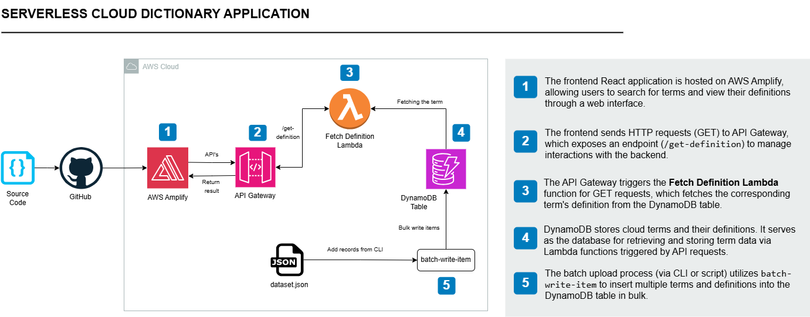

# Serverless Cloud Dictionary

A modern serverless cloud dictionary application built with React and AWS services. Users can search for terms related to cloud technologies and view their definitions through a responsive frontend powered by serverless backend infrastructure.

## Overview 📚

This project demonstrates a complete serverless architecture where users can:

- **Search** for terms related to cloud technologies
- **View** definitions of cloud terms
- **Utilize** a fully serverless architecture using AWS services
- **Interact** with a scalable, managed database

The application leverages Lambda for backend processing, API Gateway for managing API endpoints, and DynamoDB for storing dictionary terms and definitions. The React frontend is hosted on AWS Amplify, with all API requests communicating seamlessly with the backend infrastructure.

## Services Used 🛠

| Service | Purpose | Role |
|---------|---------|------|
| **AWS Amplify** | Frontend Hosting | Host the React application with continuous deployment |
| **AWS Lambda** | Backend Processing | Handle API requests for retrieving and adding terms |
| **AWS API Gateway** | API Management | Manage API endpoints for frontend-backend communication |
| **AWS DynamoDB** | Data Storage | Store dictionary terms and their definitions |
| **IAM Roles & Policies** | Permissions | Secure access to AWS resources (Lambda, DynamoDB, API Gateway) |

## Architecture ✍️

## Deployment 🌐

To deploy this application to AWS Amplify:

1. Connect your repository to AWS Amplify
2. Configure build settings
3. Deploy the frontend
4. Set up Lambda functions and API Gateway
5. Configure DynamoDB tables
6. Update API endpoints in the React application

## License 📄

This project is licensed under the terms specified in the [LICENSE](LICENSE) file.
